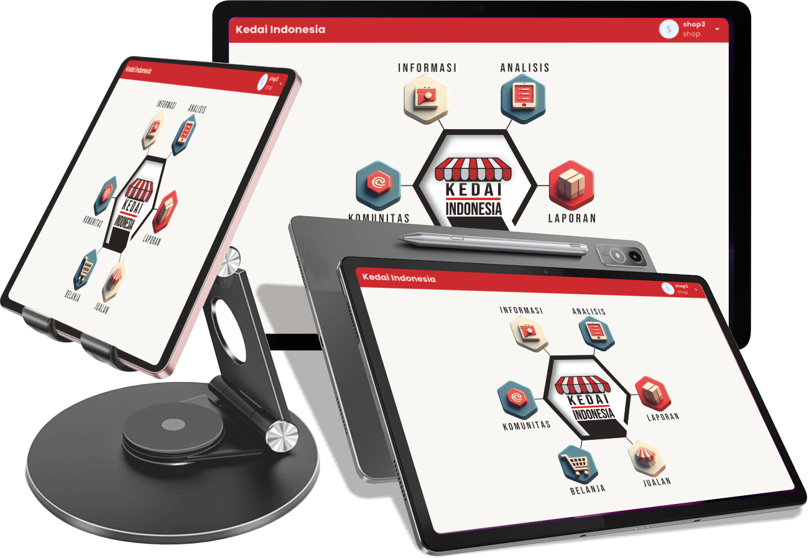

# 🇮🇩 Kedai Indonesia - Aplikasi Kasir (POS) Cerdas
## PT. Indonesia Maxima Teknologi

Selamat datang di halaman unduhan resmi **Kedai Indonesia**! Aplikasi Point of Sale (POS) modern yang dirancang untuk merevolusi cara Anda mengelola bisnis. Dilengkapi dengan fitur cerdas mulai dari analisis data hingga program sosial, Kedai Indonesia adalah partner digital terbaik untuk UMKM dan toko di seluruh Indonesia.

---

## 📲 Unduh Versi Terbaru

Dapatkan versi stabil terbaru dari aplikasi Kedai Indonesia dengan mengklik tombol di bawah ini atau kunjungi halaman **Releases**.

  

---

## ✨ Fitur Unggulan

Kedai Indonesia bukan sekadar aplikasi kasir biasa. Kami menyematkan teknologi cerdas untuk membantu bisnis Anda tumbuh.

| Ikon | Fitur | Deskripsi |
| :---: | --- | --- |
| ⚡️ | **Transaksi Cepat & Cerdas** | Sistem merekomendasikan produk berdasarkan data penjualan, sisa stok, dan tanggal kedaluwarsa untuk memaksimalkan perputaran barang dan mengurangi kerugian. |
| 👥 | **Manajemen Multi-Pengguna** | Kelola hak akses secara fleksibel untuk setiap peran: **Owner**, **Manager**, **Kasir**, dan **Guest**. Setiap peran memiliki dashboard dan wewenang yang disesuaikan. |
| 🖨️ | **Penjualan Pintar** | Terintegrasi penuh dengan perangkat keras esensial seperti **Barcode Scanner** untuk input data cepat dan **Printer Thermal** untuk mencetak struk secara profesional. |
| ❤️ | **Rekomendasi Donasi Otomatis** | Fitur sosial unik yang secara otomatis merekomendasikan dan menyalurkan donasi/infaq dari sebagian keuntungan atau pembulatan transaksi ke lembaga terpercaya yang telah dipilih. |
| 📊 | **Analisis & Sistem Pendukung Keputusan (SPK)** | Dapatkan laporan analisis mendalam mengenai penjualan, keuntungan, dan tren produk. Sistem kami memberikan rekomendasi strategis untuk membantu Anda mengambil keputusan bisnis yang lebih baik. |
| 🤝 | **Komunitas & Informasi** | Terhubung dengan sesama pengguna Kedai Indonesia melalui fitur komunitas. Dapatkan juga informasi terbaru, tips bisnis, dan promo menarik langsung dari aplikasi. |

---

## ⚙️ Cara Instalasi

Untuk memasang aplikasi di perangkat Android Anda, ikuti langkah-langkah berikut:

1.  **Unduh File**: Unduh file `.apk` dari halaman **[Releases](https://github.com/username/repo-name/releases/latest)**.
2.  **Izinkan Instalasi**: Buka **Pengaturan** > **Keamanan** di perangkat Anda, lalu aktifkan opsi **"Instal dari Sumber Tidak Dikenal"** atau **"Install unknown apps"**. Langkah ini diperlukan karena Anda menginstal aplikasi di luar Google Play Store.
3.  **Instal Aplikasi**: Buka file manager Anda, cari file `.apk` yang telah diunduh, lalu ketuk file tersebut untuk memulai proses instalasi.
4.  **Selesai**: Setelah instalasi berhasil, Anda dapat membuka dan mulai menggunakan aplikasi Kedai Indonesia!

---

## 📝 Umpan Balik & Dukungan

Kami sangat menghargai masukan dari Anda! Jika Anda menemukan bug, memiliki saran fitur, atau ingin bertanya, silakan:

* **Buat "Issue" Baru**: Cara terbaik adalah dengan membuat laporan melalui tab **[Issues](https://github.com/BimaFdilana/Kedai-Indonesia-IMAGI/issues)** di repositori ini.

---

## 📜 Lisensi

Aplikasi ini didistribusikan di bawah Lisensi [MIT](https://www.kedaiindonesia.cloud/)

